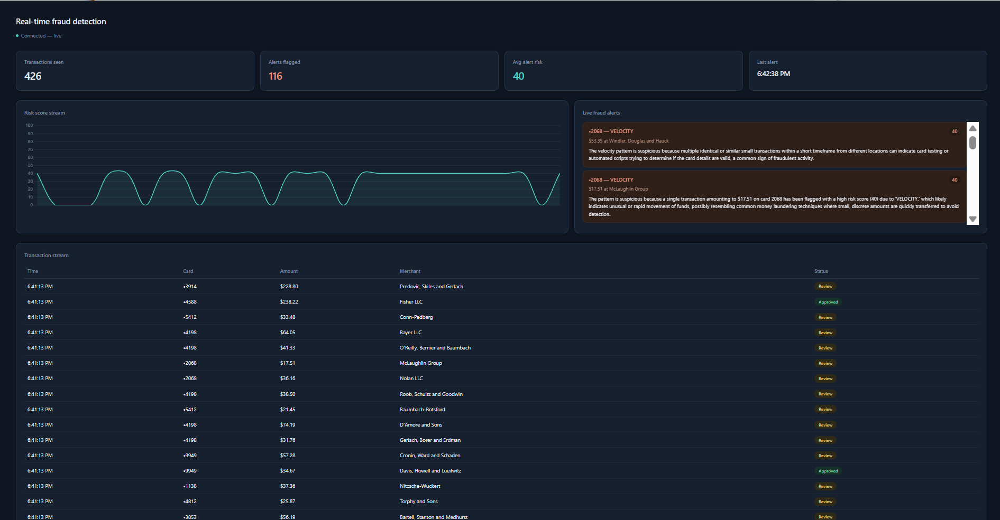
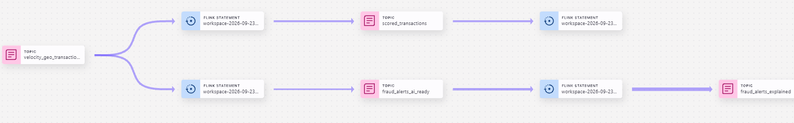

# Real-Time Fraud Detection with Confluent

A real-time fraud detection pipeline built on Confluent Cloud for **Dev Day — Most Impactful App**.

Synthetic card transactions stream through Kafka, get enriched with customer
profile data captured live via CDC from Postgres, are scored for fraud risk
by Apache Flink using three independent detection signals, explained in
plain English by an LLM called directly from the Flink SQL pipeline, and
surfaced on a live dashboard the moment they're flagged.

---

## Table of contents

- [What this app does](#what-this-app-does)
- [Why it matters](#why-it-matters)
- [Architecture](#architecture)
- [Confluent technology used](#confluent-technology-used)
    - [Connector](#connector)
    - [Stream processing (Flink)](#stream-processing-flink)
    - [AI/ML function](#aiml-function)
    - [Stream governance](#stream-governance)
- [Repository layout](#repository-layout)
- [Setup](#setup)
- [Running the demo](#running-the-demo)
- [Screenshots](#screenshots)

---

## What this app does

Every few seconds, a Spring Boot service generates a synthetic card
transaction — merchant, amount, location, device — and publishes it to
Kafka. Most of these look completely ordinary. A small percentage are
deliberately generated to *look* like one of three real fraud patterns:

| Pattern | What it looks like | Detected by |
|---|---|---|
| **Velocity** | The same card makes 5+ purchases within 2 minutes | A windowed count over a rolling time range |
| **Amount anomaly** | A purchase far above that customer's normal spend | Comparing the transaction to the customer's historical average |
| **Geo-velocity** | The same card is used in two far-apart cities faster than physically possible | A haversine-distance calculation between consecutive transaction locations |

Each transaction is enriched with that customer's profile (average spend,
home location, risk tier) — data that lives in a **Postgres database** and
streams into Kafka in real time via **Change Data Capture (CDC)**, so the
scoring logic always has up-to-date context.

Transactions that cross a risk threshold get a **plain-English explanation**
generated by an LLM, called directly from inside the Flink SQL pipeline —
turning `"VELOCITY, risk 76"` into *"This card made seven purchases in under
two minutes, a pattern consistent with card-testing fraud."*

Everything shows up live on a dashboard: a rolling risk-score chart, a
transaction feed with Approved/Review/Blocked status, and an alert panel
with the AI-generated explanations.



*The dashboard mid-demo: a velocity-fraud burst on card •7716 has just been
flagged, complete with an AI-generated explanation, while the transaction
stream keeps flowing underneath.*

## Why it matters

Most fraud detection in production today is a **batch job** — a nightly
process that flags yesterday's fraud after the money has already moved and
the customer has already noticed. This app demonstrates the same detection
logic running as a **continuous stream**, catching a suspicious pattern in
the same few seconds it takes to happen, instead of the next morning.

## Architecture

```
Spring Boot TransactionProducer
  generates synthetic transactions (Avro), ~1 every 10s in the background,
  or on-demand via POST /api/demo/inject/{velocity|geo}
        |
        v
  Kafka topic: transactions ------------------------------------+
                                                                 |
Postgres customer_profiles (home city, avg spend, risk tier)    |
        |                                                       |
        | Postgres CDC Source Connector                         |
        | (Debezium, Confluent Cloud managed)                   |
        v                                                       |
  Kafka topic: cdc.public.customer_profiles                     |
        |                                                       |
        +------------------------+------------------------------+
                                  v
                    Flink SQL: enriched_transactions
                    (join transactions + customer_profiles)
                                  |
                                  v
                    Flink SQL: velocity_geo_transactions
                    (windowed velocity count + haversine
                     geo-velocity, computed on the raw
                     append-only transaction stream)
                                  |
                                  v
                    Flink SQL: scored_transactions
                    (joins in amount-anomaly signal,
                     combines all three into risk_score)
                                  |
                    +-------------+--------------+
                    v                            v
         Flink SQL: fraud_alerts      Flink SQL: fraud_alerts_ai_ready
         (risk_score > 70)            (velocity/geo flags only --
                                       append-only, safe for AI call)
                                                  |
                                                  v
                                     Flink SQL: fraud_alerts_explained
                                     (calls Confluent's managed LLM via
                                      ML_PREDICT for a human explanation)
                                                  |
                    +-----------------------------+-----------------+
                    v                                               v
      Spring Boot ScoredTransactionConsumer          Spring Boot FraudAlertConsumer
      (every transaction, for the table)             (AI-explained alerts, for the feed)
                    |                                               |
                    +-------------------+---------------------------+
                                        v
                          Server-Sent Events -> dashboard.html
                          (live risk chart, transaction table,
                           alert feed)
```

## Confluent technology used

### Connector

**Postgres CDC Source Connector** (Debezium-based, fully managed by
Confluent Cloud) streams every change to the `customer_profiles` table --
home location, average spend, risk tier -- into Kafka in real time. This is
what keeps the fraud-scoring pipeline's customer context current without
any polling or batch refresh.

### Stream processing (Flink)

Five chained Flink SQL jobs, each reading from the previous stage's output
topic:

1. **`enriched_transactions`** -- joins the raw transaction stream against
   `customer_profiles` to attach home location, average spend, and risk
   tier to every transaction.
2. **`velocity_geo_transactions`** -- computes two signals directly on the
   append-only transaction stream using windowed SQL:
    - `COUNT(*) OVER (PARTITION BY card_id ORDER BY event_time RANGE BETWEEN
     INTERVAL '2' MINUTE PRECEDING AND CURRENT ROW)` for velocity
    - A haversine great-circle distance calculation between a card's
      consecutive transaction locations, divided by elapsed time, to get an
      implied travel speed in km/h
3. **`scored_transactions`** -- joins in the amount-anomaly signal
   (transaction amount divided by the customer's historical average) and
   combines all three signals into a single 0-100 `risk_score` with a
   `reason_code`.
4. **`fraud_alerts`** -- filters to `risk_score > 70`.
5. **`fraud_alerts_ai_ready`** -- a parallel, profile-free filter used
   specifically to feed the AI step (see below).

### AI/ML function

**`ML_PREDICT`**, calling Confluent Cloud's own **fully-managed LLM**
(`microsoft/Phi-3.5-mini-instruct`, provider `confluent` -- no external API
key or connection resource required), turns each flagged transaction's raw
signals into a one-sentence explanation a fraud analyst could act on
immediately, generated live inside the SQL pipeline:

```sql
CREATE MODEL `fraud_explainer`
INPUT (prompt STRING)
OUTPUT (response STRING)
WITH (
    'provider' = 'confluent',
    'task' = 'text_generation',
    'confluent.model' = 'microsoft/Phi-3.5-mini-instruct'
);
```

*Why a separate, profile-free input table feeds this step:* `ML_PREDICT`
calls are non-deterministic, and Flink won't run a non-deterministic
function on any stream that's structurally capable of emitting
updates/retractions (which `fraud_alerts` is, as a side effect of the
customer-profile join upstream). `fraud_alerts_ai_ready` is sourced
directly from the append-only `velocity_geo_transactions` stream instead,
satisfying that requirement -- a real constraint hit and solved while
building this.

### Stream governance

**Schema Registry** enforces an Avro schema on every topic in this
pipeline -- eight subjects total, each independently versioned, visible in
Confluent Cloud's **Schemas** page with compatibility mode `BACKWARD`.

The `transactions` schema was evolved **live**, mid-build, to add a new
`device_id` field:

```json
{
  "name": "device_id",
  "type": ["null", "string"],
  "default": null
}
```

Because it's optional with a null default, Schema Registry accepted it as
backward-compatible -- meaning it registered as **version 2** without
requiring any of the five already-running Flink jobs to stop or restart.
That's the actual governance story this app demonstrates: a live schema
change, validated automatically, with zero downstream disruption.

Confluent Cloud's **Stream Lineage** view shows this entire pipeline as one
connected graph, from the Postgres CDC source through every Flink stage to
the final dashboard consumers:



## Repository layout

```
src/main/java/com/confluent/frauddetectionapp/
  producer/       TransactionProducer (synthetic data + fraud injection),
                  CardPool (recurring fake cards/customers)
  consumer/       FraudAlertConsumer, ScoredTransactionConsumer
                  (read Flink's output, feed the dashboard)
  config/         KafkaConfig (typed + GenericRecord Kafka beans)
  controller/     FraudInjectionController (manual demo triggers),
                  DashboardController (SSE endpoint)
  service/        AlertBroadcaster (fans out to connected dashboard tabs)
src/main/resources/
  avro/           transaction.avsc (the schema evolved live for the demo)
  static/         dashboard.html (+ theme variants)
  application.properties
flink-sql/        every Flink SQL statement, numbered in run order
connectors/       Postgres seed script + connector setup notes
docs/             setup notes, screenshots
```

## Setup

1. **Confluent Cloud**: create a Basic Kafka cluster, enable Schema
   Registry, create topics (`transactions`; `cdc.public.customer_profiles`
   is created automatically by the connector)
2. **Postgres** (e.g. Neon): run `connectors/postgres_seed.sql` to create
   and seed `customer_profiles`, plus the logical replication slot and
   publication the CDC connector needs
3. **Postgres CDC Source Connector**: configure in Confluent Cloud
   pointing at that Postgres instance (see `connectors/` for details)
4. **Spring Boot app**: fill in your Confluent Cloud credentials in
   `application.properties` (bootstrap server, Kafka API key/secret,
   Schema Registry URL/key/secret -- use a **cluster-scoped** API key, not
   a Global one, since Basic clusters don't support Global keys), then
   `mvn spring-boot:run`
5. **Flink SQL**: run every file in `flink-sql/`, in numeric order, in a
   Confluent Cloud Flink SQL workspace (one statement per cell)

## Running the demo

With the app running, open `http://localhost:8080/dashboard.html`.

Background traffic generates automatically. To force a fraud pattern on
demand instead of waiting:

```bash
curl -X POST http://localhost:8080/api/demo/inject/velocity
curl -X POST http://localhost:8080/api/demo/inject/geo
```

Expect roughly 5-15 seconds from trigger to dashboard -- most of that is
the live LLM call generating the explanation.

## Screenshots

The live dashboard and stream lineage graph are shown above, inline with
the relevant sections. Add this one more for the submission:

- `schemas.png` -- the Schema Registry subjects list showing all eight
  governed topics and the `BACKWARD` compatibility mode
